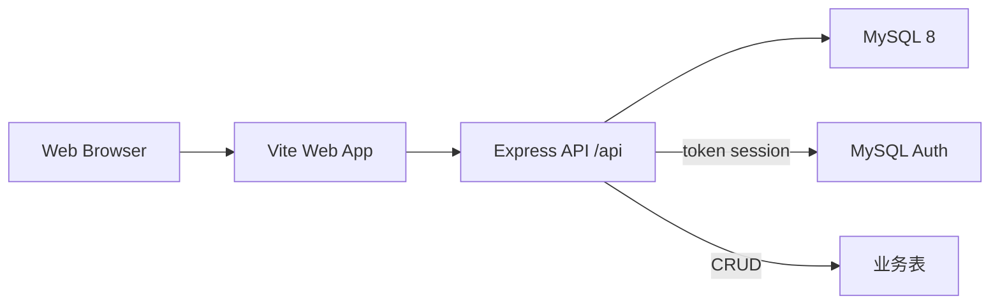
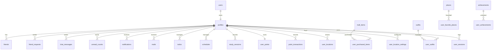

# TRIX Web 端 MySQL 作业版

## 1. 项目目标

将 TRIX 3D Companion 的 Web 端改造为课堂作业版：
- 保留现有 Web 菜单和路由
- 仅覆盖 Web 端，不修改 iOS / Desktop
- 数据库与登录迁移到 MySQL
- 课堂演示主链路完全依赖 MySQL

## 2. 系统架构

## 3. ER 关系图

## 4. 关系模式

- `users(id, email, username, password_hash, created_at, updated_at)`
- `profiles(id, username, email, avatar_url, avatar_config, full_name, display_name, bio, points, website, is_studying, companion_id, total_study_time, last_active_at, current_streak, days_active, interaction_count, show_online_status, school, grade, active_session_id, created_at, updated_at)`
- `friends(id, user_id, friend_id, name, avatar_url, status, bio, study_time, is_studying, created_at, updated_at)`
- `friend_requests(id, from_user_id, to_user_id, status, message, created_at, updated_at)`
- `chat_messages(id, conversation_id, sender_id, receiver_id, text, is_read, message_type, media_uri, media_type, media_size, media_metadata, voice_url, voice_duration, voice_transcript, voice_mime_type, created_at)`
- `unread_counts(id, user_id, friend_id, unread_count, last_message, last_message_time, updated_at)`
- `notifications(id, user_id, type, title, content, avatar_url, is_read, created_at)`
- `mails(id, user_id, from_user_id, from_name, from_avatar, subject, preview, content, is_read, created_at)`
- `todos(id, user_id, title, description, completed, priority, due_date, tags, sync_status, created_at, updated_at)`
- `schedules(id, user_id, title, description, start_time, end_time, all_day, location, reminder_minutes_before, reminder_minutes, repeat_type, color, sync_status, created_at, updated_at)`
- `study_sessions(id, user_id, subject, duration, started_at, ended_at, start_time, end_time, notes, companion_id, tags, focus_score, is_completed, earned_points, created_at)`
- `user_points(id, user_id, total_points, level, total_earned, total_spent, created_at, updated_at)`
- `point_transactions(id, user_id, amount, type, points_change, transaction_type, description, related_item_id, metadata, balance_after, created_at)`
- `mall_items(id, name, description, image_url, price, category, display_order, is_active, created_at)`
- `user_purchased_items(id, user_id, item_id, quantity, points_spent, purchased_at)`
- `outfits(id, name, category, image_url, preview_image_url, description, price, is_active, created_at)`
- `user_outfits(id, user_id, outfit_id, is_equipped, purchased_at)`
- `places(id, name, category, latitude, longitude, description, emoji, open_hours, is_active, created_at)`
- `user_locations(id, user_id, latitude, longitude, accuracy, is_sharing, updated_at)`
- `user_location_settings(id, user_id, is_enabled, visibility, show_accuracy, update_interval, updated_at)`
- `user_favorite_places(id, user_id, place_id, created_at)`
- `user_sessions(id, user_id, platform, device_id, device_name, device_info, session_token, clawbot_endpoint, is_active, created_at, last_active_at, expires_at)`
- `user_settings(id, user_id, allow_stranger_search, show_online_status, allow_study_invites, created_at, updated_at)`
- `feature_flags(id, key, enabled, value, description, environment, rollout_percentage, target_user_ids, target_groups, updated_at)`
- `achievements(id, name, name_en, description, icon, category, requirement, type, rarity, points_reward)`
- `user_achievements(id, user_id, achievement_id, metadata, unlocked_at)`

## 5. 数据字典要点

### `users`
- `password_hash`: `salt:hash` 的 scrypt 结果
- `username`: 登录名，唯一
- `email`: 邮箱，唯一

### `profiles`
- `companion_id`: 当前学习搭子
- `active_session_id`: 当前活跃会话
- `points`: 页面展示用积分字段

### `chat_messages`
- `conversation_id`: 由两个用户 ID 拼接生成
- `message_type`: `text/image/video/file/voice/mixed`
- `voice_*`: 语音消息兼容字段

### `user_points` / `point_transactions`
- `user_points`: 当前余额和统计
- `point_transactions`: 交易流水，兼容商城扣分和学习奖励

### `user_sessions`
- Web 端登录态与设备态记录
- 同一平台同一用户只保留一条活跃记录

## 6. 主要 API

- `POST /api/auth/register`
- `POST /api/auth/login`
- `POST /api/auth/logout`
- `GET /api/auth/me`
- `GET /api/profile`
- `PATCH /api/profile`
- `GET /api/todos`
- `GET /api/study/sessions`
- `GET /api/friends`
- `GET /api/chat/messages`
- `GET /api/points`
- `GET /api/mall/items`
- `GET /api/wardrobe/outfits`
- `GET /api/places`
- `GET /api/locations/me`
- `GET /api/notifications`
- `GET /api/mails`
- `GET /api/health`
- `GET /api/db/health`

## 7. 演示步骤

1. 启动 MySQL，导入 `database/mysql/schema.sql`
2. 导入 `database/mysql/seed.sql`
3. 配置 `.env`
4. 启动 `npm run dev:api`
5. 启动 `npm run dev`
6. 使用 `test1@trix.app / 123456` 登录
7. 演示待办、学习记录、聊天、积分商城、衣柜、地图和通知

## 8. PPT 提纲

1. 课题背景
2. 系统目标
3. 技术架构
4. 数据库设计
5. API 设计
6. 登录与权限
7. 核心功能演示
8. 测试与验证
9. 总结
