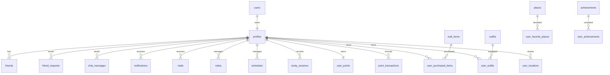

# TRIX Web MySQL 数据库设计与数据字典

## 1. 数据库概述

数据库名称为 `trix_companion`，面向 TRIX Web 作业版。所有业务表使用 InnoDB，字符集为 `utf8mb4`，主键采用 `CHAR(36)` 存储 UUID。后端统一使用 `crypto.randomUUID()` 生成新记录 ID，并通过参数化 SQL 访问 MySQL。

## 2. E-R 图

## 3. 关系模式

主码为每张表的 `id` 字段；外码在字段说明中标注 `FK`。

| 分组 | 关系模式 |
|------|----------|
| 用户 | `users(id, email, username, password_hash, created_at, updated_at)` |
| 资料 | `profiles(id, username, email, avatar_url, avatar_config, full_name, display_name, bio, points, website, is_studying, companion_id, total_study_time, last_active_at, current_streak, days_active, interaction_count, show_online_status, school, grade, active_session_id, created_at, updated_at)` |
| 好友 | `friends(id, user_id, friend_id, name, avatar_url, status, bio, study_time, is_studying, created_at, updated_at)` |
| 好友请求 | `friend_requests(id, from_user_id, to_user_id, status, message, created_at, updated_at)` |
| 聊天 | `chat_messages(id, conversation_id, sender_id, receiver_id, text, is_read, message_type, media_uri, media_type, media_size, media_metadata, voice_url, voice_duration, voice_transcript, voice_mime_type, created_at)` |
| 待办 | `todos(id, user_id, title, description, completed, priority, due_date, tags, sync_status, created_at, updated_at)` |
| 学习 | `study_sessions(id, user_id, subject, duration, started_at, ended_at, start_time, end_time, notes, companion_id, tags, focus_score, is_completed, earned_points, created_at)` |
| 积分 | `user_points(id, user_id, total_points, level, total_earned, total_spent, created_at, updated_at)` |
| 积分流水 | `point_transactions(id, user_id, amount, type, points_change, transaction_type, description, related_item_id, metadata, balance_after, created_at)` |
| 商城 | `mall_items(id, name, description, image_url, price, category, display_order, is_active, created_at)` |
| 衣柜 | `outfits(id, name, category, image_url, preview_image_url, description, price, is_active, created_at)` |
| 地图 | `places(id, name, category, latitude, longitude, description, emoji, open_hours, is_active, created_at)` |
| 通知邮件 | `notifications(id, user_id, type, title, content, avatar_url, is_read, created_at)`, `mails(id, user_id, from_user_id, from_name, from_avatar, subject, preview, content, is_read, created_at)` |

## 4. 关键数据字典

| 表名 | 字段 | 类型 | 约束/含义 |
|------|------|------|-----------|
| `users` | `id` | `CHAR(36)` | 主码，用户唯一编号 |
| `users` | `email` | `VARCHAR(255)` | 唯一，登录邮箱 |
| `users` | `username` | `VARCHAR(80)` | 唯一，用户名称 |
| `users` | `password_hash` | `VARCHAR(255)` | `salt:hash` 格式，scrypt 哈希 |
| `profiles` | `id` | `CHAR(36)` | 主码，同时 FK 到 `users.id` |
| `profiles` | `companion_id` | `CHAR(36)` | FK 到 `profiles.id`，当前学习搭子 |
| `friends` | `user_id` | `CHAR(36)` | FK 到 `profiles.id`，关系拥有者 |
| `friends` | `friend_id` | `CHAR(36)` | FK 到 `profiles.id`，好友 |
| `chat_messages` | `conversation_id` | `VARCHAR(100)` | 两个用户 ID 组成的会话键 |
| `chat_messages` | `sender_id` | `CHAR(36)` | FK 到 `profiles.id`，发送者 |
| `chat_messages` | `receiver_id` | `CHAR(36)` | FK 到 `profiles.id`，接收者 |
| `todos` | `user_id` | `CHAR(36)` | FK 到 `profiles.id`，待办所属用户 |
| `todos` | `completed` | `BOOLEAN` | 是否完成 |
| `study_sessions` | `duration` | `INT` | 学习时长，单位分钟 |
| `study_sessions` | `earned_points` | `INT` | 本次学习奖励积分 |
| `user_points` | `user_id` | `CHAR(36)` | 唯一 FK，用户积分账户 |
| `point_transactions` | `balance_after` | `INT` | 本次交易后的积分余额 |
| `mall_items` | `price` | `INT` | 商品价格，单位积分 |
| `outfits` | `category` | `VARCHAR(40)` | 外观分类，如 hat、clothes |
| `user_outfits` | `is_equipped` | `BOOLEAN` | 是否当前穿戴 |
| `places` | `latitude` / `longitude` | `DECIMAL(10,7)` | 地点坐标 |
| `notifications` | `is_read` | `BOOLEAN` | 是否已读 |
| `mails` | `from_user_id` | `CHAR(36)` | FK，可为空，发件人 |

## 5. 完整性约束

- 实体完整性：所有核心业务表都有主键。
- 参照完整性：用户相关表通过外键指向 `profiles(id)`，用户删除时级联删除其私有业务数据。
- 用户隔离：后端对 `todos`、`study_sessions`、`notifications`、`mails` 等用户表自动追加 `user_id = 当前用户` 条件。
- 唯一约束：邮箱、用户名、好友对、用户积分账户、用户位置等字段避免重复数据。
- 索引设计：按用户 ID、时间、状态、分类等高频查询字段建立索引。

## 6. 种子数据

`database/mysql/seed.sql` 提供课堂演示数据：

| 账号 | 密码 | 用途 |
|------|------|------|
| `test1@trix.app` | `123456` | 主演示账号 |
| `test2@trix.app` | `123456` | 好友和聊天对象 |
| `test3@trix.app` | `123456` | 学习导师和更多关系数据 |

种子数据覆盖用户资料、好友、聊天、待办、学习记录、积分、商城、衣柜、地图、通知和邮件，便于课堂现场演示。
